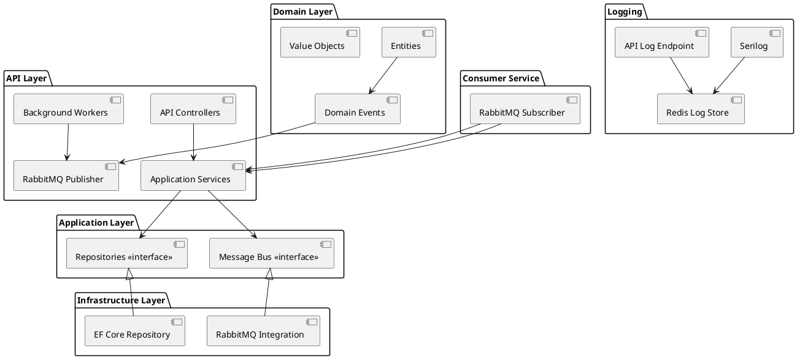
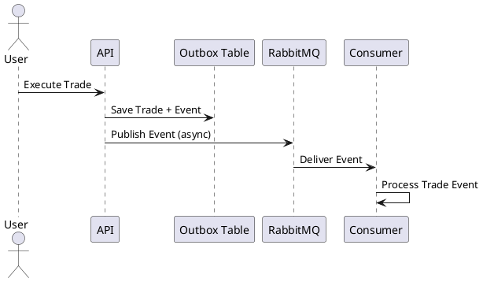
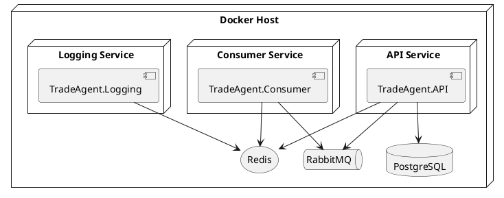

# 🚀 MeDirect.TradeAgent

A **scalable trading management platform** for MeDirect, designed with **Clean Architecture**, **Domain-Driven Design (DDD)**, and **asynchronous event-driven communication** using **RabbitMQ**.  

---

## 🏗️ Architecture Overview



✨ **Highlights**  
- Core **business rules** live in the **Domain Layer**  
- **Application Layer** orchestrates workflows  
- **Infrastructure Layer** → EF Core + RabbitMQ + Redis  
- **API Layer** exposes endpoints & publishes events  
- **Consumer Service** processes messages asynchronously  
- **Logging Layer** centralizes logs in Redis  

---

## 📦 Messaging Flow



---

## 🌐 Deployment View



---

## ✨ Key Features

- 🧼 Clean, maintainable, and testable architecture  
- 🏛️ Rich domain models & domain events (DDD)  
- 📨 Asynchronous event publishing & consumption via RabbitMQ  
- 📦 Outbox pattern for reliable delivery  
- 🪵 Centralized distributed logging with Redis + Serilog  
- 🐳 Containerized deployment with Docker Compose  
- ✅ Unit + integration tests  
- ⚡ CI/CD with GitHub Actions  

---

## 🧱 SOLID Principles

- **SRP 🧩** – One responsibility per class  
- **OCP ➕** – Open for extension, closed for modification  
- **LSP 🔄** – Subtypes replace supertypes safely  
- **ISP ✂️** – Small, focused interfaces  
- **DIP 🔌** – High-level modules depend on abstractions  

---

## 🐳 Containerization

`docker-compose.yaml` provisions:  
- 🗄 PostgreSQL + PGAdmin  
- 📨 RabbitMQ + Management UI  
- 🔴 Redis for logging  
- 🌐 API + Consumer services  

Start all services:  

```bash
docker compose up --build
```

---

## 🔥 Logging Architecture

- 📊 **Serilog** → structured logs  
- 🪣 Logs stored in **Redis**  
- 🌐 Logs retrievable from `/api/demologs`  

---

## 🧪 Testing

- 🧩 **Unit Tests** → business logic & services  
- 🔗 **Integration Tests** → API, messaging, persistence  

---

## ⚡ CI/CD with GitHub Actions

- ✅ Builds & tests on each push/PR  
- 🚦 Prevents regressions & ensures quality  

---

## 📂 Projects

- `TradeAgent.Domain` 🏛️ – Entities, Value Objects, Domain Events  
- `TradeAgent.Application` 🎯 – DTOs, Services, Abstractions  
- `TradeAgent.Infrastructure` 🔧 – EF Core, RabbitMQ, Redis  
- `TradeAgent.API` 🌐 – Web API + Background Workers  
- `TradeAgent.Consumer` 📥 – RabbitMQ Consumer Service  
- `TradeAgent.Logging` 🪵 – Centralized Logging  
- `TradeAgent.Tests` ✅ – Unit & Integration Tests  

---

## 📜 License

Licensed under the **MIT License**.
