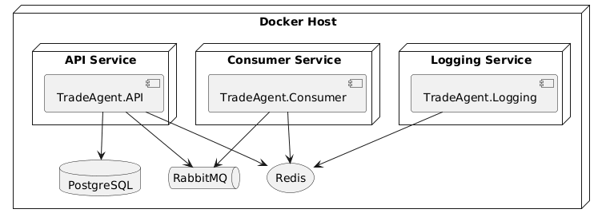

# 🚀 MeDirect.TradeAgent

A **scalable trading management platform** for MeDirect, designed with **Clean Architecture**, **Domain-Driven Design (DDD)**, and **asynchronous event-driven communication** using **RabbitMQ**.  

---

https://github.com/keskinsinancan/MeDirect.TradeAgent

---

## 🏗️ Architecture Overview


✨ **Highlights**  
- Core **business rules** live in the **Domain Layer**  
- **Application Layer** orchestrates workflows  
- **Infrastructure Layer** → EF Core + RabbitMQ + Redis  
- **API Layer** exposes endpoints & publishes events  
- **Consumer Service** processes messages asynchronously  
- **Logging Layer** centralizes logs in Redis  

---

## 📦 Messaging Flow


---

## 🌐 Deployment View



---

## ✨ Key Features

- 🧼 Clean, maintainable, and testable architecture  
- 🏛️ Rich domain models & domain events (DDD)  
- 📨 Asynchronous event publishing & consumption via RabbitMQ  
- 📦 Outbox pattern for reliable delivery  
- 🪵 Centralized distributed logging with Redis + Serilog  
- 🐳 Containerized deployment with Docker Compose  
- ✅ Unit + integration tests  
- ⚡ CI/CD with GitHub Actions  

---

## 🧱 SOLID Principles

- **SRP 🧩** – Each class and module has one responsibility. For example, domain entities encapsulate business logic, while services handle orchestration, and repositories manage data access.
- **OCP ➕** – The system is open for extension but closed for modification. New features (such as new event types or logging sinks) can be added without changing existing code, thanks to abstractions and interfaces.
- **LSP 🔄** –  Components and services are designed so that derived types can be substituted for their base types without affecting correctness. Interfaces and base classes are used consistently across layers.
- **ISP ✂️** –  Interfaces are kept focused and specific. For example, repository and messaging interfaces define only the methods relevant to their responsibilities, avoiding unnecessary dependencies.
- **DIP 🔌** –  High-level modules do not depend on low-level modules; both depend on abstractions. Dependency injection is used throughout the application, allowing easy swapping of implementations (e.g., for testing or infrastructure changes).

---

## 🐳 Containerization

`docker-compose.yaml` provisions:  
- 🗄 PostgreSQL + PGAdmin  
- 📨 RabbitMQ + Management UI  
- 🔴 Redis for logging  
- 🌐 API + Consumer services  

Start all services:  
Takes a few minutes to setup all components in the first run.
```bash
docker compose up --build
```

---

## 🌐 Accessing the Application

Once the containers are up and running, the API service is reachable from your browser at [http://localhost:5000/swagger/index.html].  
This allows you to interact with the platform's endpoints, monitor logs, and verify message processing in real time.

---

---

## 🗄️ DB-First Approach & Automated Migrations

- **📝 DBrist Approach**  
  The platform follows the **DBrist approach**, emphasizing **versioned and automated database schema changes**.  
  ✅ Ensures the database state is always in sync with the application code  
  ✅ Reduces manual intervention  
  ✅ Supports continuous delivery  

- **⚡ Automated Migrations on Startup**  
  On application startup, **Entity Framework Core migrations** are automatically applied.  
  This ensures the database schema is always **up-to-date**, providing consistency and reliability across environments.  

  Example in `Program.cs`:

  ```csharp
  using (var scope = app.Services.CreateScope())
  {
      var db = scope.ServiceProvider.GetRequiredService<TradeAgentDbContext>();
      db.Database.Migrate();
  }


---

## 🔥 Logging Architecture

- 📊 **Serilog** → Serilog is configured as the main logging provider in both the API and Consumer projects. It captures log events throughout the application lifecycle.
- 🪣 Logs stored in **Redis**   The `TradeAgent.Logging` project contains the `DistributedDemoLogStore` class, which is responsible for writing log entries to a Redis instance. This allows logs to be shared and accessed across multiple services and instances.
- 🌐 Logs retrievable from `/api/demologs`  

This approach provides centralized, scalable, and real-time logging for all services in the platform.

---

## 🧪 Testing

- 🧩 **Unit Tests** → The solution includes unit tests for core business logic, services, and utility classes. These tests ensure correctness and reliability of individual components.
- 🔗 **Integration Tests** → Integration tests validate the interaction between components, such as messaging, data persistence, and API endpoints. They ensure the system works as expected in real scenarios.

---

## ⚡ CI/CD with GitHub Actions

- ✅ Builds & tests on each push/PR  
- 🚦 Prevents regressions & ensures quality  

https://github.com/keskinsinancan/MeDirect.TradeAgent/actions

---

## 📂 Projects

- `TradeAgent.Domain` 🏛️ – Entities, Value Objects, Domain Events  
- `TradeAgent.Application` 🎯 – DTOs, Services, Abstractions  
- `TradeAgent.Infrastructure` 🔧 – EF Core, RabbitMQ, Redis  
- `TradeAgent.API` 🌐 – Web API + Background Workers  
- `TradeAgent.Consumer` 📥 – RabbitMQ Consumer Service  
- `TradeAgent.Logging` 🪵 – Centralized Logging  
- `TradeAgent.Tests` ✅ – Unit & Integration Tests  

---

---

## 🧩 Microservice Architecture

MeDirect.TradeAgent is a **modern microservice-based system** demonstrating scalability, resilience, and maintainability:

- **⚙️ Service Independence**  
  The **API** and **Consumer** are separate deployable services, each with its own responsibility and lifecycle.  
  ✅ Enables independent scaling, deployment, and fault isolation.  

- **🔗 Decoupled Communication**  
  Services communicate **asynchronously** via RabbitMQ, following **event-driven patterns**.  
  ✅ Reduces direct dependencies and allows loose coupling between components.  

- **📦 Distributed Data & State**  
  Each service manages its **own data and configuration**.  
  🪵 Centralized logging is handled via Redis, while business data remains isolated per service.  

- **🐳 Containerization**  
  All services and dependencies (**PostgreSQL, RabbitMQ, Redis**) are containerized with Docker Compose.  
  ✅ Supports easy orchestration, scaling, and local development.  

- **⚡ Resilience & Scalability**  
  Event-driven communication and the **outbox pattern** ensure reliable message delivery and processing under load or failure conditions.  

- **👁️ Observability**  
  Centralized logging (Serilog + Redis) and API endpoints for log retrieval provide visibility into **service health and activity**.  

- **🚀 Automated Migrations & CI/CD**  
  Database migrations are applied automatically on startup, and **GitHub Actions** handle automated builds, tests, and deployments.  

- **🧪 Testing**  
  Unit and integration tests validate each service independently and in combination, supporting robust, maintainable development.  

**📌 Summary:**  
This architecture embodies core microservice principles:  
- Independent services  
- Asynchronous communication  
- Decentralized data  
- Containerization  
- Observability  
- Automation  

It is designed for **scalable, resilient, and maintainable enterprise solutions**.

---

## 📜 License

Licensed under the **MIT License**.
